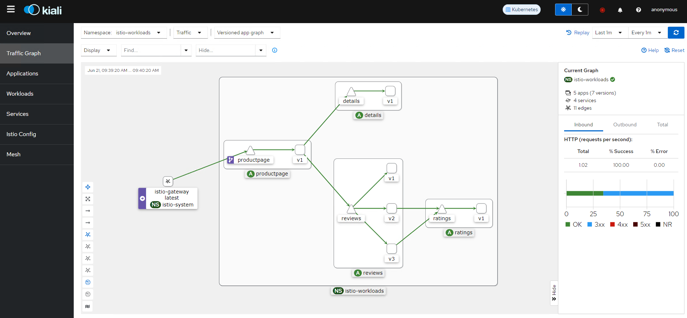

# ISTIO sample applications and Telemetry Addons

These manifests and resources were copied from the release-1.22 branch of the [Istio samples official GitHub Repository](https://github.com/istio/istio/tree/release-1.22/samples), but were adapted for using the Istio packages provided by TMC-SM 1.3 and its specific configuration parameters, for **AIRGAPPED ENVIRONMENTS**. Installed Istio package version is 1.22.0.

## BookInfo sample App

The Bookinfo k8s manifests retrieve the container images from a private harbor registry, so first of all, these images need to be copied to that private registry.

In our case, the private registry is harbor.tanzu.lab. You may need to replace the private registgry FQDN in the following commands.


```
$> docker login harbor.tanzu.lab

$> docker pull docker.io/istio/examples-bookinfo-productpage-v1:1.20.1
$> docker pull docker.io/istio/examples-bookinfo-details-v1:1.20.1
$> docker pull docker.io/istio/examples-bookinfo-ratings-v1:1.20.1
$> docker pull docker.io/istio/examples-bookinfo-reviews-v1:1.20.1
$> docker pull docker.io/istio/examples-bookinfo-reviews-v2:1.20.1
$> docker pull docker.io/istio/examples-bookinfo-reviews-v3:1.20.1

$> docker tag istio/examples-bookinfo-productpage-v1:1.20.1 harbor.tanzu.lab/library/istio/examples-bookinfo-productpage-v1:1.20.1
$> docker tag istio/examples-bookinfo-details-v1:1.20.1 harbor.tanzu.lab/library/istio/examples-bookinfo-details-v1:1.20.1
$> docker tag istio/examples-bookinfo-ratings-v1:1.20.1 harbor.tanzu.lab/library/istio/examples-bookinfo-ratings-v1:1.20.1
$> docker tag istio/examples-bookinfo-reviews-v1:1.20.1 harbor.tanzu.lab/library/istio/examples-bookinfo-reviews-v1:1.20.1
$> docker tag istio/examples-bookinfo-reviews-v2:1.20.1 harbor.tanzu.lab/library/istio/examples-bookinfo-reviews-v2:1.20.1
$> docker tag istio/examples-bookinfo-reviews-v3:1.20.1 harbor.tanzu.lab/library/istio/examples-bookinfo-reviews-v3:1.20.1

$> docker push harbor.tanzu.lab/library/istio/examples-bookinfo-productpage-v1:1.20.1
$> docker push harbor.tanzu.lab/library/istio/examples-bookinfo-details-v1:1.20.1
$> docker push harbor.tanzu.lab/library/istio/examples-bookinfo-ratings-v1:1.20.1
$> docker push harbor.tanzu.lab/library/istio/examples-bookinfo-reviews-v1:1.20.1
$> docker push harbor.tanzu.lab/library/istio/examples-bookinfo-reviews-v2:1.20.1
$> docker push harbor.tanzu.lab/library/istio/examples-bookinfo-reviews-v3:1.20.1
```

After the images have been copied, to install the bookinfo app, run the following commands:

```
$> kubectl create ns istio-workloads
$> kubectl label --overwrite ns istio-workloads istio-injection=enabled

$> kubectl apply -f bookinginfo.yaml -n istio-workloads
$> kubectl apply -f bookinfo-gateway.yaml -n istio-workloads
```

To obtain the LB IP address, run the following command and pick the EXTERNAL-IP:

```
$> kubectl get svc -n istio-system istio-gateway
```

To access the bookinfo application, use this URL: http://<EXTERNAL-IP>/productpage

## Telemetry Addons

The Bookinfo k8s manifests retrieve the container images from a private harbor registry, so first of all, these images need to be copied to that private registry.

The addons directory contains sample deployments of various addons that integrate with Istio. While these applications are not a part of Istio, they are essential to making the most of Istio's observability features.

To deploy them, we also need to copy the images to our private registry. In our case, the private registry is harbor.tanzu.lab. You may need to replace the private registgry FQDN in the following commands:

```
$> docker pull docker.io/jaegertracing/all-in-one:1.56
$> docker pull quay.io/kiali/kiali:v1.86
$> docker pull docker.io/grafana/loki:3.0.0
$> docker pull docker.io/grafana/grafana:10.4.0
$> docker pull ghcr.io/prometheus-operator/prometheus-config-reloader:v0.72.0
$> docker pull prom/prometheus:v2.51.1
$> docker pull apache/skywalking-oap-server:9.7.0
$> docker pull apache/skywalking-ui:9.1.0
$> docker pull openzipkin/zipkin-slim:3.1.1

$> docker tag docker.io/jaegertracing/all-in-one:1.56 harbor.tanzu.lab/library/jaegertracing/all-in-one:1.56
$> docker tag quay.io/kiali/kiali:v1.86 harbor.tanzu.lab/library/kiali/kiali:v1.86
$> docker tag docker.io/grafana/loki:3.0.0 harbor.tanzu.lab/library/grafana/loki:3.0.0
$> docker tag docker.io/grafana/grafana:10.4.0 harbor.tanzu.lab/library/docker.io/grafana/grafana:10.4.0
$> docker tag ghcr.io/prometheus-operator/prometheus-config-reloader:v0.72.0 harbor.tanzu.lab/library/prometheus-operator/prometheus-config-reloader:v0.72.0
$> docker tag prom/prometheus:v2.51.1 harbor.tanzu.lab/library/prom/prometheus:v2.51.1
$> docker tag apache/skywalking-oap-server:9.7.0 harbor.tanzu.lab/library/apache/skywalking-oap-server:9.7.0
$> docker tag apache/skywalking-ui:9.1.0 harbor.tanzu.lab/library/apache/skywalking-ui:9.1.0
$> docker tag openzipkin/zipkin-slim:3.1.1 harbor.tanzu.lab/library/openzipkin/zipkin-slim:3.1.1

$> docker push harbor.tanzu.lab/library/jaegertracing/all-in-one:1.56
$> docker push harbor.tanzu.lab/library/kiali/kiali:v1.86
$> docker push harbor.tanzu.lab/library/grafana/loki:3.0.0
$> docker push harbor.tanzu.lab/library/docker.io/grafana/grafana:10.4.0
$> docker push harbor.tanzu.lab/library/prometheus-operator/prometheus-config-reloader:v0.72.0
$> docker push harbor.tanzu.lab/library/prom/prometheus:v2.51.1
$> docker push harbor.tanzu.lab/library/apache/skywalking-oap-server:9.7.0
$> docker push harbor.tanzu.lab/library/apache/skywalking-ui:9.1.0
$> docker push harbor.tanzu.lab/library/openzipkin/zipkin-slim:3.1.1
```

To install the addons, run the following commands:

```
$> kubectl apply -f addons
$> kubectl rollout status deployment/kiali -n istio-system
``` 

Install the istioctl CLI and run the kiali dasboard:

```
$> curl -L https://istio.io/downloadIstio | ISTIO_VERSION=1.22.0 TARGET_ARCH=x86_64 sh -
$> cd istio-1.22.0/bin
$> ./istioctl dashboard kiali
```

To access the Kiali UI, open your internet browser and nagivate to this URL: http://localhost:20001/kiali 
You'll need to generate traffic in the BookInfo App to view results in the Traffic Graph:


